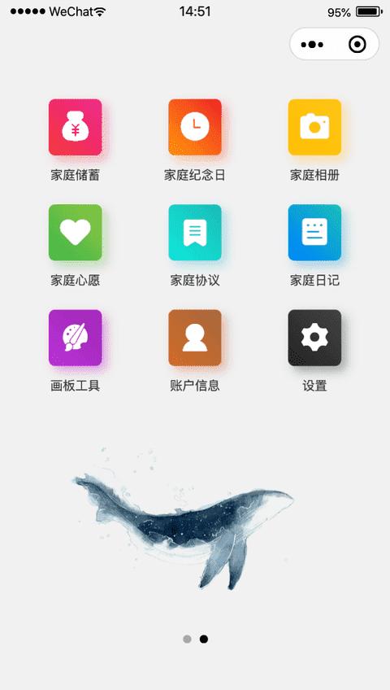
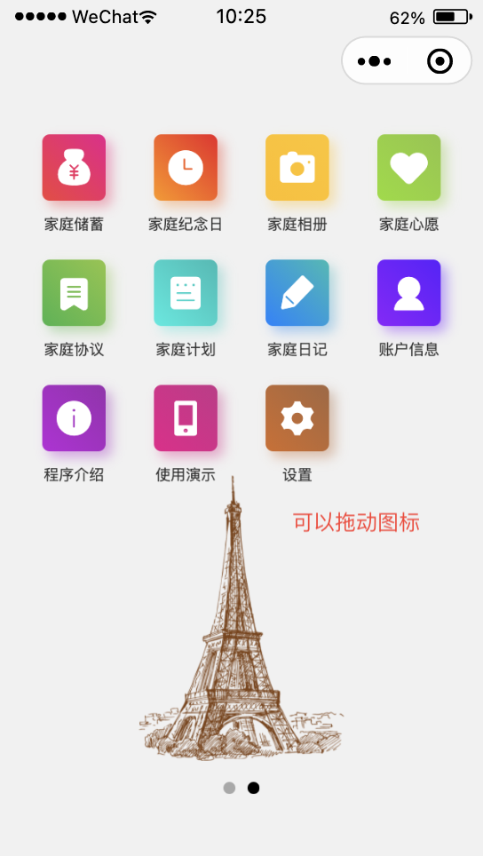
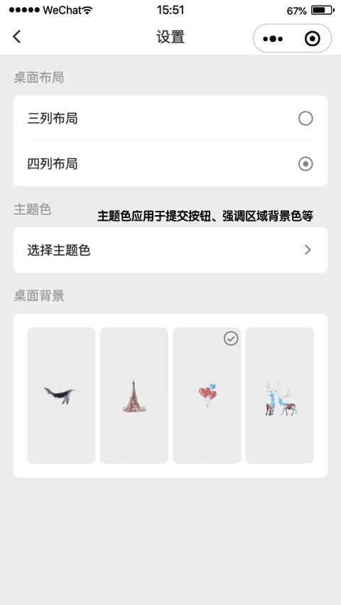
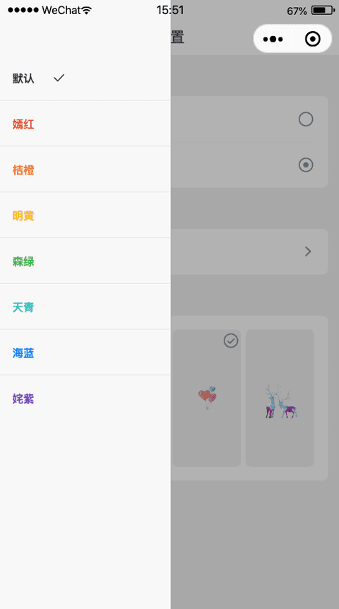
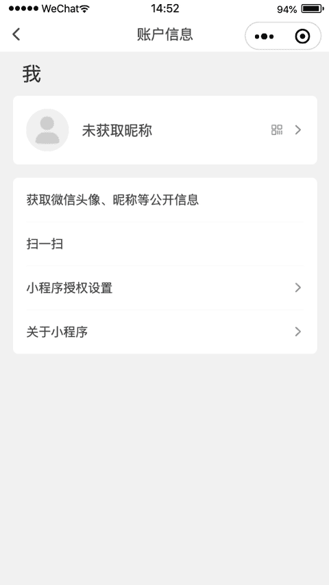
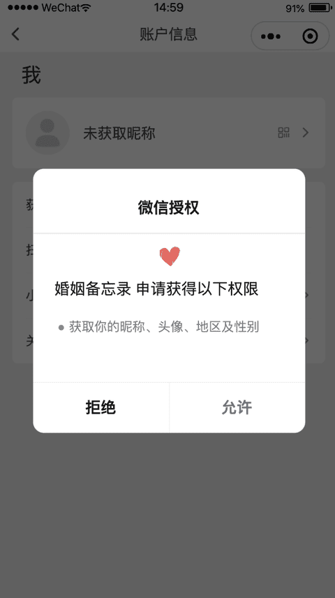
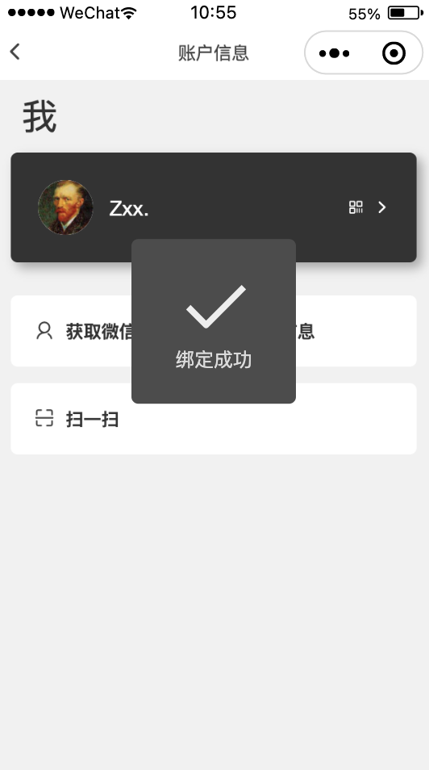
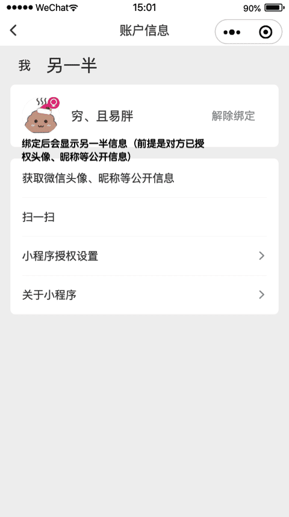
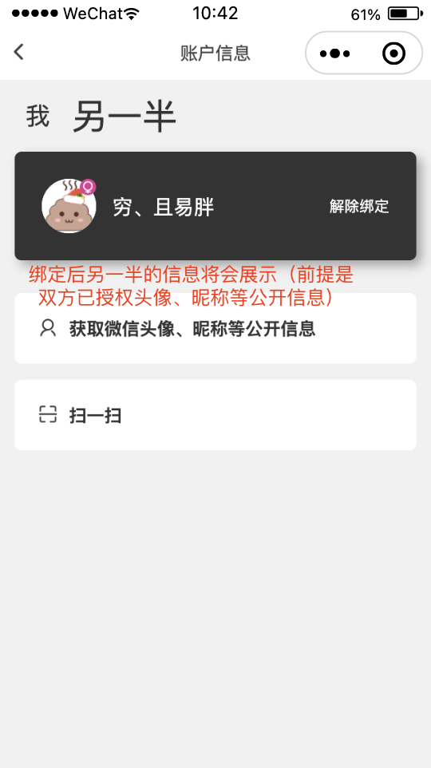

## 家庭备忘录（基于小程序云开发）

### 主功能

- 设置：桌面布局、主题色、桌面背景；
- 账户信息：绑定、解绑、信息授权、信息展示、关于小程序；
- 家庭储蓄：增、删、查；
- 家庭纪念日：增、删；
- 家庭相册：增、删、改；
- 家庭心愿：增、删；
- 家庭协议：增、删；
- 家庭日记：增、删；
- 家庭计划：增、删、改、查；
- 休闲游戏：2048；
- 使用演示；
- 程序介绍；

### 二维码：

### 运行项目

- 克隆项目到本地
- 安装云函数依赖：wx-server-sdk（云函数在cloudfunction文件夹）
- 导入项目到【微信开发者工具】

### 效果图：

